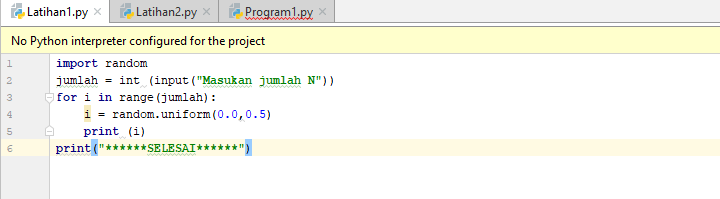
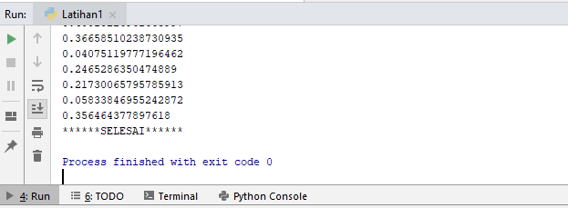
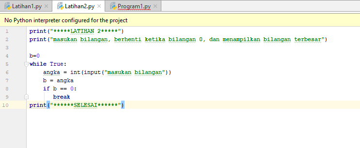
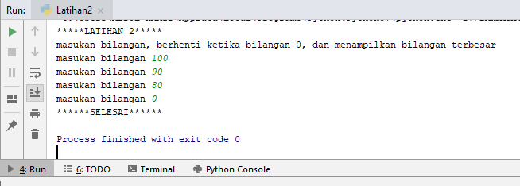
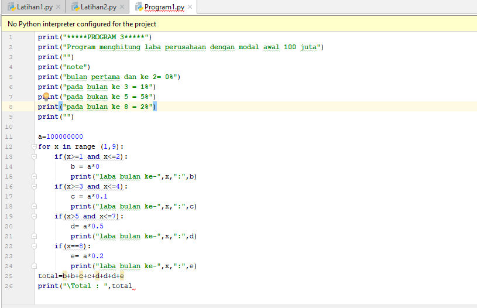
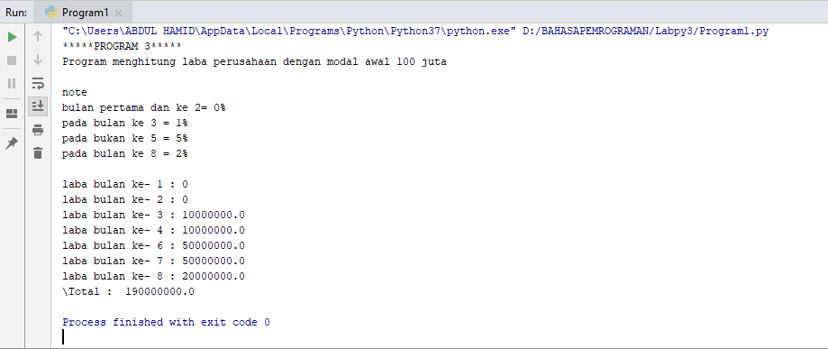

Xy# labpy03
# LATIHAN1

    Tampilkan n bilangan acak yang nilainya lebih dari 0.5
    Nilai n pada saat di runfile
    Anda bisa menggunakan kombinasi while dan for untuk menyelesaikannya

# Contoh Outputnya

#  <h2>

# Tampilan Ketika Sudah Di Run Dan Memasukkan Jumlah N

#  <h2>

# LATIHAN2

Program untuk menampilkan bilangan terbesar dari n buah data yang
diinputkan. Dan Memasukan angka 0 untuk berhenti

# Contoh Outputnya

#  <h2>

# Tampilan Ketika Sudah Di Run Dan Memasukkan Bilangannya

#  <h2>

# PROGRAM1.py

Seorang pengusaha menginvestasikan uangnya untuk memulai usahanya dengan
modal awal 100 juta, pada bulan pertama dan kedua belum mendapatkan
laba, pada bulan ketiga baru mulai mendapatkan laba sebesar 1% dan pada
bulan kelima, pendapatan meningkat 5%, selanjutnya pada bulan ke delapan
mengalami penurunan keuntungan sebesar 2%, sehingga laba menjadi 3%.
diinputkan. Dan Memasukan angka 0 untuk berhenti

# Contoh Outputnya

#  <h2>

# Tampilan Ketika Sudah Di Run Dan Memasukkan Bilangannya

#  <h2>
